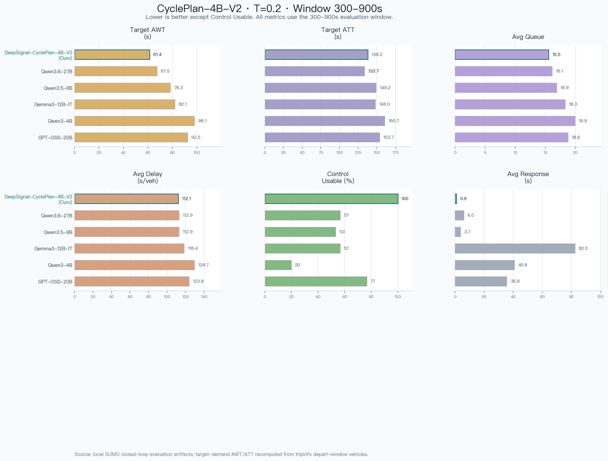

# DeepSignal-CyclePlan-4B-V2 (F16 GGUF)

本仓库发布 DeepSignal-CyclePlan 系列的 4B V2 版本（F16 GGUF），适用于 llama.cpp、LM Studio 等本地推理环境。模型面向周期级绿灯时长分配任务：输入某个路口各相位的预测交通状态后，输出下一信号周期中每个相位的最终绿灯时长，并满足每个相位的最小/最大绿灯约束。

该版本基于 Qwen3 4B 架构，是 DeepSignal-CyclePlan-4B 系列的后续版本更新，当前主要用于 SUMO 仿真、交通信号配时研究和本地控制器原型验证。

## Chengdu SUMO 场景配置

评估使用仓库中的 Chengdu SUMO 场景。闭环评估脚本读取 `chengdu_benchmark/scenarios/sumo_llm/osm.sumocfg`，该配置加载 `ChengduCity.net.xml` 路网，以及 `morning_rush_hour.rou.xml`、`rush_hour_flow.rou.xml` 两个交通需求文件。仓库根目录下的 `chengdu/chengdu.sumocfg` 是同一场景的独立运行版本，使用相同结构的路网与 route 文件。

该 Chengdu 路网包含 46 个信号控制器、852 条道路边和 579 个 junction。评估时从该场景中选取目标信号控制器进行周期级闭环控制：模型在每个控制周期读取相位级预测等待量、饱和度和绿灯约束，输出下一周期各相位的绿灯时长。

## 模型列表

本仓库当前包含：

- `DeepSignal-CyclePlan-4B-V2`：用于下一周期所有相位绿灯时长分配的 CyclePlan 模型。

## 模型文件

| 文件名 | 任务 | 量化 | 大小 | 说明 |
|---|---|---:|---:|---|
| `DeepSignal-CyclePlan-4B-V2-F16.gguf` | 周期级配时 | F16 | 约 7.5 GB | 高精度发布版本 |

## DeepSignal-CyclePlan-4B-V2

`DeepSignal-CyclePlan-4B-V2` 接收下一周期的预测交通状态，并输出可机器解析的信号配时方案。评测时使用 DeepSignal 风格 prompt：模型先给出极简推理，再将最终 JSON 方案放在 `<SOLUTION>...</SOLUTION>` 内。

### 推荐 Prompt 格式

System prompt:

```text
你是交通信号配时优化专家。
```

User Prompt（模板）：

```text
【cycle_predict_input_json】{
  "prediction": {
    "as_of": "<时间戳>",
    "phase_waits": [
      {
        "phase_id": <int>,
        "pred_wait": <float>,
        "pred_saturation": <float>,
        "min_green": <int>,
        "max_green": <int>,
        "capacity": <int>
      }
      // ... 更多相位
    ]
  }
}【/cycle_predict_input_json】

任务（必须完成）：
基于 prediction.phase_waits 的 pred_saturation，在满足全部硬约束前提下，输出下一周期各相位最终绿灯时间 final（单位：秒）。

输入字段说明：
- prediction.phase_waits[*].min_green / max_green：绿灯时长上下限，单位秒。
- prediction.phase_waits[*].pred_wait：预测等待车辆数。
- prediction.phase_waits[*].pred_saturation：预测饱和度（pred_wait / capacity）。
- prediction.phase_waits[*].capacity：相位容量，仅供参考。

硬约束（必须满足）：
1) 相位顺序固定：严格按 prediction.phase_waits 的顺序考虑并输出；不可跳相、不可重排。
2) 每相位约束：final 必须满足 prediction.phase_waits[*].min_green <= final <= prediction.phase_waits[*].max_green。
3) final 必须为整数秒。

决策提示（非硬约束）：
- 最终决策以 pred_saturation 为主，capacity 仅供参考。

输出要求（必须严格遵守）：
1) 必须先输出 <start_working_out>...</end_working_out>，其中只写思考分析过程，不要输出最终 JSON。
2) 随后输出 <SOLUTION>...</SOLUTION>；<SOLUTION> 内只允许最终 JSON，不允许其它文本。
3) JSON 顶层必须是对象(dict)，键为相位ID的字符串，值为整数秒，键必须使用双引号。
4) 必须覆盖 prediction.phase_waits 中所有相位ID，不能缺少或多余。
5) 除 <start_working_out>...</end_working_out> 与 <SOLUTION>...</SOLUTION> 外，不允许输出任何其它文本。
```

输入 JSON 建议使用 `【cycle_predict_input_json】...【/cycle_predict_input_json】` 包裹。核心字段为 `prediction.phase_waits`，其中包含 `phase_id`、`pred_wait`、`pred_saturation`、`min_green`、`max_green` 和 `capacity`。其中 `pred_saturation = pred_wait / capacity`。

模型最终应先输出推理块，再在 `<SOLUTION>...</SOLUTION>` 中输出 JSON 对象，例如 `<SOLUTION>{"1": 55, "2": 30}</SOLUTION>`；其中键为相位 ID 字符串，值为该相位最终绿灯时长的整数秒。

### llama.cpp 快速开始

```bash
llama-cli -m DeepSignal-CyclePlan-4B-V2-F16.gguf \
  --ctx-size 4096 \
  --temp 0.2 \
  --n-predict 2048 \
  -p '你是交通信号配时优化专家。
【cycle_predict_input_json】{
  "prediction": {
    "as_of": "2026-04-27 00:02:27",
    "phase_waits": [
      {"phase_id": 1, "pred_wait": 0.4, "pred_saturation": 0.0083, "min_green": 50, "max_green": 80, "capacity": 48},
      {"phase_id": 2, "pred_wait": 1.0, "pred_saturation": 0.0250, "min_green": 20, "max_green": 45, "capacity": 40}
    ]
  }
}【/cycle_predict_input_json】

任务（必须完成）：
基于 prediction.phase_waits 的 pred_saturation，在满足全部硬约束前提下，输出下一周期各相位最终绿灯时间 final（单位：秒）。

输入字段说明：
- prediction.phase_waits[*].min_green / max_green：绿灯时长上下限，单位秒。
- prediction.phase_waits[*].pred_wait：预测等待车辆数。
- prediction.phase_waits[*].pred_saturation：预测饱和度（pred_wait / capacity）。
- prediction.phase_waits[*].capacity：相位容量，仅供参考。

硬约束（必须满足）：
1) 相位顺序固定：严格按 prediction.phase_waits 的顺序考虑并输出；不可跳相、不可重排。
2) 每相位约束：final 必须满足 prediction.phase_waits[*].min_green <= final <= prediction.phase_waits[*].max_green。
3) final 必须为整数秒。

输出要求（必须严格遵守）：
1) 必须先输出 <start_working_out>...</end_working_out>，其中只写思考分析过程，不要输出最终 JSON。
2) 随后输出 <SOLUTION>...</SOLUTION>；<SOLUTION> 内只允许最终 JSON，不允许其它文本。
3) JSON 顶层必须是对象(dict)，键为相位ID的字符串，值为整数秒。'
```

### 期望输出

模型最终答案应包含可机器解析的配时方案：

```text
<start_working_out>...</end_working_out>
<SOLUTION>{"1": 55, "2": 30}</SOLUTION>
```

### 下载示例

```bash
huggingface-cli download AIMS2025/DeepSignal-CyclePlan-4B-V2 \
  DeepSignal-CyclePlan-4B-V2-F16.gguf \
  --local-dir .
```

## SUMO 仿真平台实验对比

### 评估设置

我们在 SUMO 仿真平台中对 `DeepSignal-CyclePlan-4B-V2` 进行闭环控制评估。模型在每个决策周期接收当前路口各相位的预测等待车辆数、预测饱和度以及最小/最大绿灯约束，并输出下一周期各相位的最终绿灯时长。仿真平台随后将该配时方案应用到 SUMO，并统计交通运行指标与模型执行指标。所有评估均在 NVIDIA GeForce RTX 5090 GPU 上进行。

本文中的对比表统一使用 `300-900s` 统计窗口，模型温度为 `0.2`，用于观察早期车辆等待表现、排队水平和控制输出稳定性。

### 评估指标

我们在 SUMO 中关注两类指标：一类反映交通运行效果，另一类反映模型输出是否能稳定进入控制闭环。

- **平均排队车辆数**（`Avg Queue`）：统计窗口内受控路口排队车辆数的平均值，越低越好。
- **目标路口平均等待时间**（`Target AWT`）：目标路口关联目标需求车辆的真实平均等待时间，来自 SUMO `tripinfo` 车辆记录，单位秒，越低越好。
- **每车平均延误**（`Avg Delay`）：车辆在仿真过程中的平均延误，单位秒/车，越低越好。
- **Control Usable**：模型输出能被解析并通过配时约束检查、可作为控制方案使用的比例，越高越好。
- **平均响应时间**（`Avg Response`）：模型单次生成配时方案的平均耗时，单位秒。

#### 指标计算方式（口径）

令 $t$ 表示评估窗口内的仿真步，$l$ 表示目标路口的受控进口车道或相位相关车道。队列与等待时间使用 SUMO/TraCI 记录的车辆状态统计得到。

- 路口排队车辆数：

$$
q(t)=\sum_l q_l(t)
$$

- 评估窗口平均排队车辆数：

$$
\mathrm{AvgQueue}=\frac{1}{T}\sum_{t=1}^{T}q(t)
$$

- 目标路口平均等待时间：

$$
\mathrm{TargetAWT}=\frac{\sum_{i \in \mathcal{V}_{target}} w_i}{|\mathcal{V}_{target}|}
$$

其中 `V_target` 表示目标路口关联目标需求车辆集合，即 SUMO 输出中车辆 ID 前缀为 `target_peak_<tl_id>_`、在评估窗口内出发并完成行程的车辆；`w_i` 表示车辆 `i` 在 SUMO `tripinfo` 中记录的累计等待时间。

- 目标路口平均旅行时间：

$$
\mathrm{TargetATT}=\frac{\sum_{i \in \mathcal{V}_{target}} \tau_i}{|\mathcal{V}_{target}|}
$$

其中 `tau_i = a_i - d_i`，`d_i` 为车辆 `i` 的出发时间，`a_i` 为到达时间；在 SUMO `tripinfo` 中可对应为车辆完成行程的 `duration`。平均旅行时间反映车辆从出发到到达的总耗时，包含行驶、停车等待和排队造成的时间消耗。

### 不同模型的指标对比表（Chengdu，300-900s）$^{**}$

| 模型 | 温度 | 目标路口平均等待时间 (s) | 目标路口平均旅行时间 (s) | 平均排队车辆数 | 每辆车平均延误 (s) | 控制可用率 | 平均响应时间 (s) |
|:---:|---:|---:|---:|---:|---:|---:|---:|
| **DeepSignal-CyclePlan-4B-V2 (Ours)** | 0.2 | **61.43** | 138.15 | **15.54** | **112.11** | **100.00%** | **0.91** |
| Qwen3.6-27B | 0.2 | 67.48 | **133.68** | 16.13 | 112.95 | 56.67% | 6.02 |
| Qwen3.5-9B | 0.2 | 78.34 | 149.16 | 16.88 | 112.90 | 53.33% | 3.70 |
| Gemma3-12B-IT | 0.2 | 82.11 | 148.01 | 18.30 | 118.43 | 56.67% | 82.51 |
| Qwen3-4B | 0.2 | 98.10 | 160.70 | 19.93 | 129.70 | 20.00% | 40.84 |
| GPT-OSS-20B | 0.2 | 92.53 | 153.73 | 18.78 | 123.80 | 76.67% | 35.58 |

`**`：该表统一使用 `300-900s` 窗口。`目标路口平均等待时间` 与 `目标路口平均旅行时间` 根据 SUMO `tripinfo` 中 `depart` 落在窗口内且完成行程的目标需求车辆统计；`平均排队车辆数` 与 `每辆车平均延误` 用于补充反映窗口内拥堵水平与车辆延误。

**结论**：在 `300-900s` 早期拥堵窗口中，**DeepSignal-CyclePlan-4B-V2** 取得最低目标路口平均等待时间（`61.43s`）、最低平均排队车辆数（`15.54`）和最低每辆车平均延误（`112.11s`）。同时，**DeepSignal-CyclePlan-4B-V2** 保持 **100%** 的控制可用率和约 **0.91s** 的平均响应时间。



### CyclePlan 评估指标说明

对于 CyclePlan 模型，本 README 更关注“模型输出能否进入控制闭环”与“进入闭环后是否改善交通指标”两个层面：

- **控制可用率**：输出是否能被解析为合法 JSON，并满足相位覆盖、相位顺序、整数秒、最小/最大绿灯时长等硬约束。
- **平均队列长度 / 目标路口平均等待时间 / 目标路口平均旅行时间 / 行程延误时间 / 每辆车平均延误**：用于衡量拥堵水平、车辆等待、旅行时间与延误表现，数值越低越好。
- **平均响应时间**：模型生成单次配时方案的平均耗时，数值越低越好。

## 适用范围

该模型适用于交通信号配时优化研究、SUMO 仿真评测和本地控制器原型验证。实际使用时，应搭配严格校验器，确保输出满足相位顺序、相位覆盖、整数秒、最小/最大绿灯时长等硬约束后，再应用到仿真或控制流程。

## 局限性

- 本模型不是通用交通控制系统，不能在未经过独立安全验证的情况下直接部署到真实路口。
- 当前评测结果来自 SUMO Chengdu 场景，迁移到其他城市、检测器布局、相位定义或交通需求分布时，效果可能发生变化。
- 模型仍可能输出格式异常或内容不完整的文本。生产环境必须加入严格解析、repair/fallback 逻辑和硬约束检查。

## License

本项目采用 Creative Commons Attribution-NonCommercial 4.0 International (CC BY-NC 4.0) 许可证。禁止商业使用。
